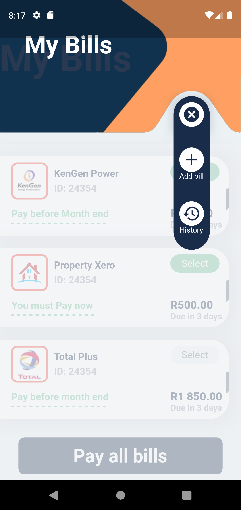

# bills_app

Bills Payment App.

  
   
   

## About the Application

This project is a Flutter application. Allows user to pay all bills in one single platform

 A few resources used to getting started with the Flutter project:

- [Lab: Write your first Flutter app](https://flutter.dev/docs/get-started/codelab)
- [Cookbook: Useful Flutter samples](https://flutter.dev/docs/cookbook)

For help getting started with Flutter, view our
[online documentation](https://flutter.dev/docs), which offers tutorials,
samples, guidance on mobile development, and a full API reference.
